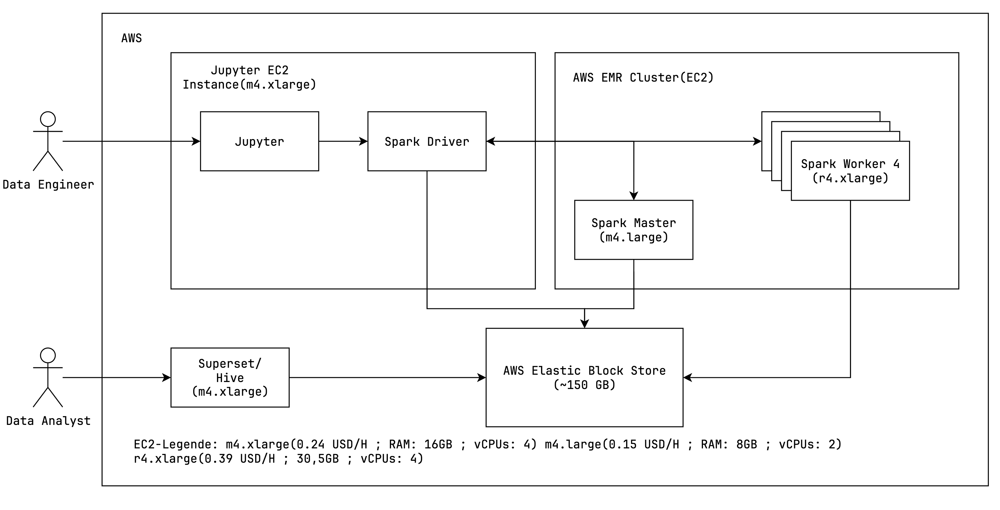

# Big Data Project

<!--- TODO: add short summary of the project --->

## TODO

- [ ] Tests erstellen
    - [X] Scalability (load, queries) -> Gleiche Datenmenge, alles In-Memory, Requests in parallelen Threads, Average
      pro Request
    - [X] Scalability (n worker) -> Gleiches Setup, unterschiedliche Anzahl an Worker, alles In-Memory
    - [X] Scalability (data) -> Unterschiedliche Datenmengen, RAM als bottleneck
    - [ ] Fault tolerance (kill worker)
- [ ] Tests ausführen
- [ ] Jupyter Notebook Markdown Erklärungen
- [ ] Diagramme von Testergebnissen
- [x] Daten bereitstellen & Einfügen ermöglichen
- [ ] GitHub Readme
    - [x] Overview (NC)
    - [x] Both Cases explained (NC)
    - [x] Nutzungsanleitung anpassen -> Daten hereinziehen, Kernel restarten
    - [x] References (Superset Docker Compose, Bitnami Docker Images)
    - [ ] Untersuchungen/Erläuterungen in Readme integrieren
- [ ] Erläuterungen
    - [ ] Prototyp
        - [X] Architektur(NC)
        - [X] Workflow (NC)
        - [ ] Superset Dashboard
    - [ ] Case
        - Big Data (Warum Big Data Case? Warum nicht mit traditionellen Lösungen umsetzbar)
        - Verteilung, Parallelisierung, Skalierbarkeit, Fault Tolerance, Data Storage
        - Shortcuts/Limitations
    - [ ] Skalierbarkeit
        - Auswirkung zusätzlicher Daten/Queries ~ Ressourcen
        - Datenfluss (IO-/Memory-/CPU-bound)
        - Skalierbarkeit der einzelnen Abschnitte
        - Partitionierung
        - Dimensionierung für Realität (Kosten, Aufwand, Expertenwissen, Hardware)
    - [ ] Fault Tolerance
        - Verhalten bei Fehlern (kill Node)
        - Verhalten Netzwerkunterbrechung
        - Auswirkung von Fehlertoleranzmechanismen auf System
- [ ] Ausblick
    - [ ] Reale Architektur (inkl. beteiligter Personen, Komponenten, Hardware) -> Parquet File(s) in HDFS Cluster
- [ ] Analyse
    - [ ] Limitierungen
        - [ ] Thrift Server
        - [ ] No HDFS

------------------------------------------------------------------------------------------------------------------------

## Overview

This is the Big-Date Project of the course "Big Data" from Tom Schuck and Kilian Kempf at the Hochschule Karlsruhe(HKA).
The goal of this project is to process
the [GDELT 2.0 Event Database](http://data.gdeltproject.org/gdeltv2/masterfilelist.txt)
with Apache Spark and visualize the results with Apache Superset. The GDELT 2.0-Event Database is a dataset that
contains
over one billion records of events from around the world. The events are collected from news articles and are updated
daily
in 15-minute intervals. With the help of this dataset, it is possible to analyze and visualize the events that have
taken
place in the world in the recent history. For example, the data can be used to analyze the events that where connected
to the
war in ukraine or the events that where connected to the corona pandemic.
The dataset is available in CSV format and can be downloaded from the [GDELT website](https://www.gdeltproject.org/).

The project is divided into two cases. In the first case, the data is processed in a non-aggregated form.
In the second case, the data is processed in an aggregated form. The aggregation depends on the needs of the user.

The project is implemented in Python and uses the following technologies:

- [Apache Spark](https://spark.apache.org/)
- [Apache Superset](https://superset.apache.org/)
- [Jupyter Notebook](https://jupyter.org/)
- [Docker](https://www.docker.com/)
- [Docker Compose](https://docs.docker.com/compose/)
- [Thrift Server](https://spark.apache.org/docs/latest/sql-distributed-sql-engine.html)

In the following, both cases are explained in more detail.

### Case 1: Non-Aggregated Data

The approach of the first case is to process the data in a non-aggregated form. The idea is to process the data in a way
that the data analyst can decide how the data should be aggregated for the visualization through the use of
SQL-Statements in Superset. The advantage of this approach is that the data analyst can decide how the data should be
aggregated. Furthermore, no data is lost to aggregation and can be displayed on demand in superset utilizing the
preprocessed data which is kept in memory in spark.
This enables the data analyst to create visualizations that are tailored to his needs on the fly.
This is achieved by caching and processing the data in Spark. The drawback is that the data needs to be processed
every time a visualization is created or loaded. This can take a relatively long time depending on the size of the data.

### Case 2: Aggregated Data

The approach of the second case is to process the data in an aggregated form. The idea is to process the data in a way
that the necessary aggregations for the visualization are already done and kept in memory. The advantage of this
approach
is that the data is already aggregated and can be visualized immediately. This is achieved by caching and processing
the data in Spark. The drawback is that the data needs to be processed again every time the data changes. Furthermore,
the data analyst cannot decide how the data should be aggregated. This means that the data analyst has to request a new
aggregation from the data engineer every time he wants to create a new visualization.

### Implemented Use Case

This project was developed with the example use case to analyze the goldstein scale of the GDELT dataset for each
country.
The goldstein scale is a scale that measures the impact of an event. The scale ranges from -10 to +10. The higher the
value, the more positive the impact of the event. The lower the value, the more negative the impact of the event.

The goal was to visualize a world heat map that visualizes the average goldstein scale for each country. The
visualization should
also be interactive. This means that the user should be able to filter the data by date and country. With this, a user
can, for example,
analyze the impact of the corona pandemic on a country.

This use case was implemented utilizing both cases (aggregated & non-aggregated data).
Regarding the implementation of the first case, the data was just preprocessed and cached in Spark without any
aggregation. By using this method, arbitrary analysis of the dataset can be conducted on demand at a fine-grained level.
To illustrate this point, the possibility was implemented in the first case to select a country in the dashboard and see the top 5 events
for that country which had the most negative impact.
For the second case, the data was preprocessed and aggregated by the average goldstein scale per country
per day. This level of aggregation was chosen to ensure that it's still possible to filter the data, which is utilized
for visualization, by date and country.

Both ways enable the user to create the desired visualization. However, which approach is better depends on the use case
and will be discussed in this project.

## Table of Contents

1. [Getting Started](#getting-started)
    - [Prerequisites](#prerequisites)
    - [Configuration](#configuration)
    - [Setup](#setup)
2. [Usage](#usage)
    - [Web Interfaces](#web-interfaces)
    - [Run Main Code](#run-main-code)
    - [Run Test Code](#run-test-code)
    - [Create Test Result Plots](#create-test-result-plots)
3. [Documentation](#documentation)
    - [Architecture](#architecture)
    - [Workflow](#workflow)
    - [Limitations & Shortcuts](#limitations--shortcuts)
    - [References](#references)
4. [Analysis](#analysis)
    - [Scalability](#scalability)
    - [Fault Tolerance](#fault-tolerance)
5. [Evaluation](#evaluation)
    - [Case 1: Pros & Cons](#case-1-pros--cons)
    - [Case 2: Pros & Cons](#case-2-pros--cons)
6. [Production Example & Recommendations](#production-example--recommendations)
7. [Conclusion](#conclusion)

## Getting Started

### Prerequisites

To run the project, you need to have [Docker](https://www.docker.com/get-started/) (including docker compose) installed
and running on your machine.

Additionally, make sure you are using WSL if you're running on Windows:

- Open docker desktop
- Navigate to `Settings` > `General`
- Tick the box next to `Use the WSL 2 based engine`
- Restart the docker engine

### Configuration

The spark cluster has the following configuration by default:

| Item      | Resources         | Total Resources (in cluster) |
|-----------|-------------------|------------------------------|
| Workers   | 3                 | 3                            |
| Executors | 2 per Worker      | 6                            |
| RAM       | 2 GB per Executor | 12 GB                        |
| Cores     | 1 per Executor    | 6                            |

This configuration was set as default, to ensure that the project can be run on most machines.

If you want to change the configuration, you can do so by navigating to `config` and adjust the following files:

- `spark-defaults.conf`: Contains configuration regarding the executors (total number of executors, RAM & cores per
  executor).
- `.env-spark`: Contains configuration regarding the workers (RAM & cores per worker) and must be set according to the
  executor configuration. E.g., the amount of RAM per worker must equal the amount of RAM per executor multiplied by the
  number of executors per worker.

The tests were executed with more memory assigned to the workers & executors (see `tests.ipynb`).

### Setup

First, you have to clone this repository.
Then open your command line and navigate to the root directory of this repository.
To set up the project, execute the following command:

```
docker compose up
```

This will automatically start and configure all necessary docker containers to run Apache Superset, Apache Spark, and a
Jupyter Server.

To shut down all containers, execute the following command:

```
docker compose down --volumes
```

## Usage

### Web Interfaces

The following web interfaces can be accessed after the setup has been completed successfully:

| Component          | URL                    | Description                                                                                                                       |
|:-------------------|:-----------------------|:----------------------------------------------------------------------------------------------------------------------------------|
| Superset Dashboard | http://localhost:8088/ | Apache Superset web interface for visualizing data processed by spark.                                                            |
| Spark Master       | http://localhost:8080/ | Web UI for the Spark master node, managing distributed processing jobs.                                                           |
| Spark Worker 1     | http://localhost:8081/ | Web UI for a Spark worker node, showing details of tasks and resource usage.                                                      |
| Spark Worker 2     | http://localhost:8082/ |                                                                                                                                   |
| Spark Worker 3     | http://localhost:8083/ |                                                                                                                                   |
| Spark Application  | http://localhost:4040/ | Spark application web UI, showing details of jobs, thrift server etc. (available when a spark session is initialized in jupyter). |
| Jupyter Notebook   | http://localhost:8888/ | JupyterLab interface to interactively execute the python code of this project.                                                    |

### Run Main Code

To run the application code of the project, you have to the following steps:

1. Open the **Jupyter Notebook** web interface
2. When prompted for a token type in `token`
3. Navigate to `notebooks` > `main.ipynb`
4. Run the code cells in the notebook
5. Open the **Superset Dashboard** to view the results
6. When prompted for a login, use the following credentials:
    - Username: `admin`
    - Password: `admin`

**Don't start a separate jupyter server to run the notebook.**

### Run Test Code

1. Open the **Jupyter Notebook** web interface
2. When prompted for a token type in `token`
3. Navigate to `notebooks` > `tests.ipynb`
4. Insert test data
    1. Navigate to `notebooks` > `data` > `parquet_test`
    2. Download the ZIP file from [bwSync&Share](https://bwsyncandshare.kit.edu/s/QTKj5jtPEH3KMkF)
    3. Extract the parquet files into the `parquet_test` directory
5. If you previously ran the main code, you need to **restart the kernel**
6. Run the code cells in the notebook

**We recommend not running the test code, as the execution can take up a full day and even longer.**

### Create Test Result Plots

1. Open the **Jupyter Notebook** web interface
2. When prompted for a token type in `token`
3. Navigate to `notebooks` > `test_evaluation.ipynb`
4. Run the code cells in the notebook

## Documentation

### Architecture

This section describes the architecture of the application.


The application is managed through a docker-compose environment. This environment consists of the following relevant
main components: **Apache Superset**, **Apache Spark Cluster**, **Jupyter Server**, **Thrift Server**.

**Apache Superset** is a data exploration and visualization web application. It is used to visualize the data processed
by Spark. If data is required for a visualization, a SQL-Query is sent to the Thrift Server.

**Apache Spark** is a distributed processing framework. It is used to process the data from the GDELT dataset.
Spark runs distributed in multiple containers with different roles. The **Spark Driver** is the main coordinator of the
application. It is responsible for scheduling the Jobs and catering to the requests from Superset. The **Spark Master**
is the main cluster coordinator of the worker nodes in the standalone deployment mode. The **Spark Worker** is a node
in the cluster that can run tasks and keep data in memory or disk storage across them. Both the Master and the Worker
work in tandem with the driver to run tasks.

**Thrift Server** is a server that enables JDBC/ODBC clients to execute SQL queries against Apache Spark.
In this case, the Thrift Server is used to enable Superset to access the data in Spark. If a SQL-Query is sent to the
Thrift Server, a new Spark job will be triggered. The Spark job will then retrieve the data from the cache and process
it according to the SQL-Statement. The processed data will then be returned to the Thrift Server and then to Superset.

**Jupyter Server** is a web application that allows you to create and share documents that contain live code, equations,
visualizations and narrative text. It is used to run the application code of the project. The application code is
written in a Jupyter Notebook. The Jupyter Server is also used to run the test code of the project.
Furthermore, the Jupyter Notebook is used to document the project and run the Spark Driver and Thrift Server.
Both the Thrift Server and the Spark Driver are started in the Jupyter Notebook because they are required to
run in the same Spark Context.

### Workflow

This section describes the general workflow of the application.

**Download Data**

At first, it is necessary to download the necessary data from the GDELT server.
The basis is the [GDELT 2.0 Event Database](http://data.gdeltproject.org/gdeltv2/masterfilelist.txt) which is available
in CSV format.
The CSV files are downloaded in a compressed form and then extracted.

After extraction, the CSV files will be converted into the parquet format through parallel and distributed processing
using Spark. The parquet format is a columnar storage format optimized for analytics workloads.
The parquet files will then be stored in the local file system.

**Process Data(Non Aggregated)**

For the first case, the data is processed in a non-aggregated form.

The data is loaded from the local file system into Spark. After that, the data is cleaned, so that
only the usable data remains. Thereafter, an additional column will be joined to the data,
which contains the country codes in the FIPS 10–4 standard. This is necessary because the country codes
which are used in the GDELT dataset are in the ISO 3166-1 alpha-2 standard which Superset does not support.

Afterward, the data will be cleaned again and then cached and provisioned as a global temporary view in Spark.
This enables the thrift server to access the data.

**Process Data(Aggregated)**

For the second case, the data is processed in an aggregated form.

The steps are the same as in the first case, except that the data is aggregated before it is cached.
The aggregation depends on the needs of the user. A data scientist can then decide how the data should be aggregated.
Subsequently, only the aggregated data is cached and provisioned as a global temporary view in Spark like in the first
case.

**Request from SuperSet**

Another component of the application is the Apache Superset dashboard. This dashboard is used to visualize
the data processed by Spark. The dashboard is connected to the Spark Thrift Server.
This enables the dashboard to access the data in Spark so that it can also utilize the distributed processing
capabilities of Spark.

If a dashboard is opened, a request including an SQL-Statement is sent to the Thrift Server.
The Thrift Server then processes the SQL-Statement and looks for the data in the specified global temporary view.
Retrieving data from the global temporary view will trigger a new Spark job.
The Spark job will then retrieve the data from the cache and process it according to the SQL-Statement.
The processed data will then be returned to the Thrift Server and then to the dashboard.
The dashboard then can utilize the returned data to visualize it according to the user's needs.

### Limitations & Shortcuts

**Thrift Server:**  
The Thrift Server is a component of Spark that enables JDBC/ODBC clients to execute SQL queries against Apache Spark.
During the development of this project, the researchers weren't able to discover a way to scale the Thrift Server
horizontally. Especially because it was a requirement that the Thrift Sever can access cached Temporary Views.
This means that the Thrift Server currently is a bottleneck and single point of failure in the application.
This is because the Thrift Server is a single instance that is not distributed. Future research would be necessary
to either find a way to scale the Thrift Server horizontally or to find an alternative to the Thrift Server.

**Storage on Local File System:**  
The data is stored in the local file system, which means that the data is neither replicated nor distributed to
different
nodes, like it would be if a distributed file system like HDFS were used.
Therefore, the data storage constitutes a single point of failure as well as an I/O bottleneck.
This decreases the performance and the scalability of the solution significantly, because Spark can't read the data
properly in parallel.
Furthermore, the data is not fault-tolerant because there is no replication, which means that if the
data is lost, it is lost forever.
This solution is not recommended for production use and was only chosen because of time constraints and the additional
complexity the integration of a distributed file system would introduce. It should be further investigated if a HDFS
cluster is beneficial for this project or if another fault-tolerant distributed file system is a more suitable solution.

**Superset Database**
TODO

**Insufficient Hardware for Tests:**
The researchers didn't have access to a cluster with sufficient hardware to test the scalability of the application.
The hardware used was a single machine with 32GB of RAM and 12 cores. This means that the scalability of the application
could not be tested properly so that some approximations and assumptions had to be made.

### References

The following components were taken from other sources, adapted, configured and integrated into this project:

- [Superset](https://github.com/apache/superset): The docker setup of the official Apache Superset repository is the
  foundation of the `docker-compose.yml` file and the startup scripts in the `docker` directory used in this project.
- [Spark](https://github.com/bitnami/containers/tree/main/bitnami/spark): The docker image is used to run the Spark
  Master and Workers.
- [Jupyter](https://github.com/jupyter/docker-stacks/tree/main/images/pyspark-notebook): The docker image includes a
  Jupyter Server and an installation of Spark.
  It is used to run the application code from the notebooks of this project and to run the Thrift Server.

## Analysis

### Data
The dataset, which was used for the analysis of this project contains all events from the GDELT 2.0-Event Database, starting in July 2015 and 

### Scalability

### Fault Tolerance

## Evaluation

### Case 1: Pros & Cons
Whether the first case is better than the second case depends on the use case. The first case is better if the data
analyst wants to analyze the data in a fine-grained way. This is because the data is not aggregated and can be analyzed
on the fly in any way. Furthermore, it is no one required to aggregate the data for the data analyst. This means that
the data analyst can create visualizations that are tailored to his needs without depending on a data engineer. 
However, the drawback is that the data needs to be processed every time a visualization is created or loaded. This can
take a relatively long time depending on the size of the data and can be quite resource-intensive.

In terms of hardware, the first case is more expensive than the second case. This is because the data needs to be
processed every time a visualization is created or loaded. This means that more data needs to be processed more often
than in the second case and that significantly more memory is required. This is because the whole dataset is necessary and
needs to be cached in memory to be processed quickly. So the first case is more expensive in terms of hardware but
cheaper in terms of development costs.

| Pros                     | Cons                 |
|--------------------------|----------------------|
| Independent              | Expensive            |
| Fine-grained data access | Long execution times |
|                          | Resource intensive   |
|                          | Complex to work with |

### Case 2: Pros & Cons
Whether the second case is better than the first case depends also on the use case. The second case is better if the data
analyst wants to analyze the data in an aggregated way. This is because the data can be preprocessed and aggregated
specifically beforehand and can be visualized immediately. Because the processing of the smaller dataset is less ressource
expensive, the overall costs will go down and the performance will increase. Furthermore, the data analyst does not need to think about
processing the whole dataset but can focus on only the necessary already aggregated data. The drawback is that the data
needs to be processed again every time the data changes. Furthermore, the data analyst cannot decide how the data should
be aggregated. This means that the data analyst has to request a new aggregation from a data engineer every time he
wants to create a new visualization.

In terms of hardware, the second case is cheaper than the first case. This is because the data is already aggregated and
does not need to be processed extensively every time a visualization is created or loaded. The memory usage spikes
only when aggregates are created and the data is cached. After that, the memory usage is way less than in the first case
because the aggregated data is way smaller than the raw data. This is under the assumption that the aggregation is not
time-critical and can be done in advance.
So the second case is cheaper in terms of hardware but more expensive in terms of development costs.

| Pros                  | Cons                        |
|-----------------------|-----------------------------|
| Short execution times | Dependant on data engineer  |
| Easy to work with     | Reprocessing on data change |
| Cost efficient        | Aggregation takes time      |
| Resource efficient    |                             |

## Production Example & Recommendations
In this example, it is to be assumed that there is a company that wants to analyze the GDELT dataset in a way so that
they can analyze the impact of global events on their and other businesses. 

The company has a data science team that is responsible for analyzing the data and a data engineering team that is
responsible for preparing the data in fitting aggregates for the data science team to analyze.

Through the results of this project, the company decides to use the second case approach to analyze the data.
This is because the second case is more cost-efficient and resource-efficient than the first case. Furthermore, they
came to the conclusion that aggregated data is sufficient for their use case and that they don't need to analyze the
data in a fine-grained way.

The company decides to use the following architecture to analyze the data, which is based on the architecture of this
project:  


The company decides to use AWS as their cloud provider.  
The data is stored in Elastic Block Store (EBS) volumes.
EBS volumes are block-level storage volumes that can be attached to EC2 instances. EBS volumes are highly available and
redundant. This means that the data is fault-tolerant and can be recovered if a failure occurs. It is estimated that about
150GB of data will be stored in the EBS volumes. This includes the raw data and the aggregated data. The businessdata
will not be considered in this estimation. The data will be stored in the parquet format because it is a columnar storage
format optimized for analytics workloads.

The data engineering team will work with a m4.xlarge EC2 instance in which a Jupyter server is running. The Jupyter
server is used to run the application code of the project. The instance is configured with 16GB of RAM and 4 vCPUs.

Furthermore, will work with an AWS EMR cluster. EMR is a managed cluster platform that simplifies running big data
frameworks, such as Apache Spark, Apache Hadoop, Apache Hive, and Apache Kafka, on AWS to process and analyze vast
amounts of data. The EMR cluster will be configured with four r4.xlarge EC2 instances. Each instance will be configured
with 30GB of RAM and 4 vCPUs. The master node will be a m4.large EC2 instance. The master node will be configured with
8GB of RAM and 2 vCPUs.

The data science team will work with a m4.xlarge EC2 instance in which a Jupyter server is running. The Jupyter server
is used to run the application code of the project. The instance is configured with 16GB of RAM and 4 vCPUs.

In this setup, the data engineering team will be responsible for preparing the data in fitting aggregates for the data
science team to analyze. The data engineering team will use the Jupyter server to run the application code of the
project. The data engineering team will also be responsible for managing the EMR cluster.
The cluster will use the EBS volumes as storage so that it can access the raw preprocessed data. Furthermore, the cluster
saves the aggregated data in the EBS volumes. This enables the data science team to access the aggregated data in Superset.

It is estimated that the aggregated data will be small enough that big data frameworks like Spark are not necessary to
process the data. Rather, the data can be processed with traditional data processing frameworks like Pandas or SuperSet.

The cost of this setup is estimated to be about 786.18$ per month. This includes the costs for the EBS volumes, the
EC2 instances, and the EMR cluster. The costs for the EBS volumes are estimated to be about 17.85$ per month. The costs
for the EC2 instances are estimated to be about 175.20$ per month. The costs for the EMR cluster are estimated to be
about 593.13$ per month. The costs for the EMR cluster are estimated to be so high because the cluster is configured with
a lot of memory. This is because the cluster needs to be able to process the whole dataset at once. The costs for the
EMR cluster could be reduced by using a smaller cluster and processing the data in batches. However, this would increase
the time it takes to process the data. The costs for the Cluster were calculated with the rough estimation that
they will be running for about 10 hours per day. The costs for the SuperSet instance were calculated with 24 hours per
day.

## Conclusion

<!---
## Notes

Connection URI from Superset to the Thrift Server

```
hive://spark@jupyter:10000/default

find [directory] -type d -empty -exec touch {}/.gitkeep \;

```
--->
