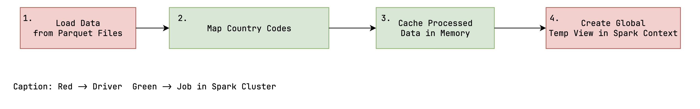

# Big Data Project

<!--- TODO: add short summary of the project --->

## TODO

- [ ] Tests erstellen
    - [X] Scalability (load, queries) -> Gleiche Datenmenge, alles In-Memory, Requests in parallelen Threads, Average
      pro Request
    - [X] Scalability (n worker) -> Gleiches Setup, unterschiedliche Anzahl an Worker, alles In-Memory
    - [X] Scalability (data) -> Unterschiedliche Datenmengen, RAM als bottleneck
    - [ ] Fault tolerance (kill worker)
- [ ] Tests ausführen
- [ ] Jupyter Notebook Markdown Erklärungen
- [ ] Diagramme von Testergebnissen
- [x] Daten bereitstellen & Einfügen ermöglichen
- [ ] GitHub Readme
    - [x] Overview (NC)
    - [x] Both Cases explained (NC)
    - [x] Nutzungsanleitung anpassen -> Daten hereinziehen, Kernel restarten
    - [x] References (Superset Docker Compose, Bitnami Docker Images)
    - [ ] Untersuchungen/Erläuterungen in Readme integrieren
- [ ] Erläuterungen
    - [ ] Prototyp
        - [X] Architektur(NC)
        - [X] Workflow (NC)
        - [ ] Superset Dashboard
    - [ ] Case
        - Big Data (Warum Big Data Case? Warum nicht mit traditionellen Lösungen umsetzbar)
        - Verteilung, Parallelisierung, Skalierbarkeit, Fault Tolerance, Data Storage
        - Shortcuts/Limitations
    - [ ] Skalierbarkeit
        - Auswirkung zusätzlicher Daten/Queries ~ Ressourcen
        - Datenfluss (IO-/Memory-/CPU-bound)
        - Skalierbarkeit der einzelnen Abschnitte
        - Partitionierung
        - Dimensionierung für Realität (Kosten, Aufwand, Expertenwissen, Hardware)
    - [ ] Fault Tolerance
        - Verhalten bei Fehlern (kill Node)
        - Verhalten Netzwerkunterbrechung
        - Auswirkung von Fehlertoleranzmechanismen auf System
- [ ] Ausblick
    - [ ] Reale Architektur (inkl. beteiligter Personen, Komponenten, Hardware) -> Parquet File(s) in HDFS Cluster
- [ ] Analyse
    - [ ] Limitierungen
        - [ ] Thrift Server
        - [ ] No HDFS

------------------------------------------------------------------------------------------------------------------------

## Overview

This is the Big-Date Project of the course "Big Data" from Tom Schuck and Kilian Kempf at the Hochschule Karlsruhe(HKA).
The goal of this project is to process
the [GDELT 2.0 Event Database](http://data.gdeltproject.org/gdeltv2/masterfilelist.txt)
with Apache Spark and visualize the results with Apache Superset. The GDELT 2.0-Event Database is a dataset that
contains
over one billion records of events from around the world. The events are collected from news articles and are updated
daily
in 15-minute intervals. With the help of this dataset, it is possible to analyze and visualize the events that have
taken
place in the world in the recent history. For example, the data can be used to analyze the events that where connected
to the
war in ukraine or the events that where connected to the corona pandemic.
The dataset is available in CSV format and can be downloaded from
the [GDELT website](https://www.gdeltproject.org/data.html#documentation).

The project is divided into two cases. In the first case, the data is processed in a non-aggregated form.
In the second case, the data is processed in an aggregated form. The aggregation depends on the needs of the user.

The project is implemented in Python and uses the following technologies:

- [Apache Spark](https://spark.apache.org/)
- [Apache Superset](https://superset.apache.org/)
- [Jupyter Notebook](https://jupyter.org/)
- [Docker](https://www.docker.com/)
- [Docker Compose](https://docs.docker.com/compose/)
- [Thrift Server](https://spark.apache.org/docs/latest/sql-distributed-sql-engine.html)

In the following, both cases are explained in more detail.

### Case 1: Non-Aggregated Data

The approach of the first case is to process the data in a non-aggregated form. The idea is to process the data in a way
that the data analyst can decide how the data should be aggregated for the visualization through the use of
SQL-Statements in Superset. The advantage of this approach is that the data analyst can decide how the data should be
aggregated. Furthermore, no data is lost to aggregation and can be displayed on demand in superset utilizing the
preprocessed data which is kept in memory in spark.
This enables the data analyst to create visualizations that are tailored to his needs on the fly.
This is achieved by caching and processing the data in Spark. The drawback is that the data needs to be processed
every time a visualization is created or loaded. This can take a relatively long time depending on the size of the data.

### Case 2: Aggregated Data

The approach of the second case is to process the data in an aggregated form. The idea is to process the data in a way
that the necessary aggregations for the visualization are already done and kept in memory. The advantage of this
approach
is that the data is already aggregated and can be visualized immediately. This is achieved by caching and processing
the data in Spark. The drawback is that the data needs to be processed again every time the data changes. Furthermore,
the data analyst cannot decide how the data should be aggregated. This means that the data analyst has to request a new
aggregation from the data engineer every time he wants to create a new visualization.

### Implemented Use Case

This project was developed with the example use case to analyze the goldstein scale of the GDELT dataset for each
country.
The goldstein scale is a scale that measures the impact of an event. The scale ranges from -10 to +10. The higher the
value, the more positive the impact of the event. The lower the value, the more negative the impact of the event.

The goal was to visualize a world heat map that visualizes the average goldstein scale for each country. The
visualization should
also be interactive. This means that the user should be able to filter the data by date and country. With this, a user
can, for example,
analyze the impact of the corona pandemic on a country.

This use case was implemented utilizing both cases (aggregated & non-aggregated data).
Regarding the implementation of the first case, the data was just preprocessed and cached in Spark without any
aggregation. By using this method arbitrary analysis of the dataset can be conducted on demand on a fine grained level.
To illustrate this point, the possbility was implemented in the first case to select a country in the dashboard and see
the top 5 events
for that country which had the most negative impact.
For the second case, the data was preprocessed and aggregated by the average goldstein scale per country
per day. This level of aggregation was chosen to ensure that it's still possible to filter the data, which is utilized
for the visualization, by date and country.

Both ways enable the user to create the desired visualization. However, which approach is better depends on the use case
and will be discussed in this project.

## Table of Contents

1. [Getting Started](#getting-started)
    - [Prerequisites](#prerequisites)
    - [Configuration](#configuration)
    - [Setup](#setup)
2. [Usage](#usage)
    - [Web Interfaces](#web-interfaces)
    - [Run Main Code](#run-main-code)
    - [Run Test Code](#run-test-code)
    - [Create Test Result Plots](#create-test-result-plots)
3. [Documentation](#documentation)
    - [Architecture](#architecture)
    - [Workflow](#workflow)
    - [Limitations & Shortcuts](#limitations--shortcuts)
    - [References](#references)
4. [Analysis](#analysis)
    - [Scalability](#scalability)
    - [Fault Tolerance](#fault-tolerance)
5. [Evaluation](#evaluation)
    - [Case 1: Pros & Cons](#case-1-pros--cons)
    - [Case 2: Pros & Cons](#case-2-pros--cons)
6. [Production Example & Recommendations](#production-example--recommendations)
7. [Conclusion](#conclusion)

## Getting Started

### Prerequisites

To run the project you need to have [Docker](https://www.docker.com/get-started/) (including docker compose) installed
and running on your machine.

Additionally, make sure you are using WSL if you're running on Windows:

- Open docker desktop
- Navigate to `Settings` > `General`
- Tick the box next to `Use the WSL 2 based engine`
- Restart the docker engine

### Configuration

The spark cluster has the following configuration by default:

| Item      | Resources        | Total Resources (in cluster) |
|-----------|------------------|------------------------------|
| Workers   | 3                | 3                            |
| Executors | 2 per Worker     | 6                            |
| RAM       | 2 GB per Executor | 12 GB                        |
| Cores     | 1 per Executor   | 6                            |

This configuration was set as default, to ensure that the project can be run on most machines.

If you want to change the configuration, you can do so by navigating to `config` and adjust the following files:

- `spark-defaults.conf`: Contains configuration regarding the executors (total number of executors, RAM & cores per
  executor).
- `.env-spark`: Contains configuration regarding the workers (RAM & cores per worker) and must be set according to the
  executor configuration. E.g. the amount of RAM per worker must equal the amount of RAM per executor multiplied by the
  number of executors per worker.

The tests were executed with more memory assigned to the workers and excutors (see [Analysis](#analysis)).

### Setup

First you have to clone this repository.
Then open your command line and navigate to the root directory of this repository.
To setup the project, execute the following command:

```
docker compose up
```

This will automatically start and configure all necessary docker containers to run Apache Superset, Apache Spark and a
Jupyter Server.

To shut down the all containers, execute the following command:

```
docker compose down --volumes
```

## Usage

### Web Interfaces

The following web interfaces can be accessed after the setup has been completed successfully:

| Component          | URL                    | Description                                                                                                                       |
|:-------------------|:-----------------------|:----------------------------------------------------------------------------------------------------------------------------------|
| Superset Dashboard | http://localhost:8088/ | Apache Superset web interface for visualizing data processed by spark.                                                            |
| Spark Master       | http://localhost:8080/ | Web UI for the Spark master node, managing distributed processing jobs.                                                           |
| Spark Worker 1     | http://localhost:8081/ | Web UI for a Spark worker node, showing details of tasks and resource usage.                                                      |
| Spark Worker 2     | http://localhost:8082/ |                                                                                                                                   |
| Spark Worker 3     | http://localhost:8083/ |                                                                                                                                   |
| Spark Application  | http://localhost:4040/ | Spark application web UI, showing details of jobs, thrift server etc. (available when a spark session is initialized in juypter). |
| Juypter Notebook   | http://localhost:8888/ | JupyterLab interface to interactively execute the python code of this project.                                                    |

### Run Main Code

To run the application code of the project you have to to the following steps:

1. Open the **Jupyter Notebook** web interface
2. When prompted for a token type in `token`
3. Navigate to `notebooks` > `main.ipynb`
4. Run the code cells in the notebook
5. Open the **Superset Dashboard** to view the results
6. When prompted for a login use the following credentials:
    - Username: `admin`
    - Password: `admin`

**Don't start a seperate jupyter server to run the notebook.**

### Run Test Code

1. Open the **Jupyter Notebook** web interface
2. When prompted for a token type in `token`
3. Navigate to `notebooks` > `tests.ipynb`
4. Insert test data
    1. Navigate to `notebooks` > `data` > `parquet_test`
    2. Download the ZIP file from [bwSync&Share](https://bwsyncandshare.kit.edu/s/QTKj5jtPEH3KMkF)
    3. Extract the parquet files into the `parquet_test` directory
4. If you previously ran the main code, you need to **restart the kernel**
5. Run the code cells in the notebook

**We recommend not to run the test code, as the execution can take up a full day and even longer.**

### Create Test Result Plots

1. Open the **Jupyter Notebook** web interface
2. When prompted for a token type in `token`
3. Navigate to `notebooks` > `test_evaluation.ipynb`
4. Run the code cells in the notebook

## Documentation

### Architecture

This section describes the architecture of the application.


The application is managed through a docker-compose environment. This environment consists of the following relevant
main components: **Apache Superset**, **Apache Spark Cluster**, **Jupyter Server**, **Thrift Server**.

**Apache Superset** is a data exploration and visualization web application. It is used to visualize the data processed
by Spark. If data is required for a visualization, a SQL-Query is sent to the Thrift Server.

**Apache Spark** is a distributed processing framework. It is used to process the data from the GDELT dataset.
Spark runs distributed in multiple containers with different roles. The **Spark Driver** is the main coordinator of the
application. It is responsible for scheduling the Jobs and catering to the requests from Superset. The **Spark Master**
is the main cluster coordinator of the worker nodes in the standalone deployment mode. The **Spark Worker** is a node
in the cluster that can run tasks and keep data in memory or disk storage across them. Both the Master and the Worker
work in tandem with the driver to run tasks.

**Thrift Server** is a server that enables JDBC/ODBC clients to execute SQL queries against Apache Spark.
In this case, the Thrift Server is used to enable Superset to access the data in Spark. If a SQL-Query is sent to the
Thrift Server, a new Spark job will be triggered. The Spark job will then retrieve the data from the cache and process
it according to the SQL-Statement. The processed data will then be returned to the Thrift Server and then to Superset.

**Jupyter Server** is a web application that allows you to create and share documents that contain live code, equations,
visualizations and narrative text. It is used to run the application code of the project. The application code is
written in a Jupyter Notebook. The Jupyter Server is also used to run the test code of the project.
Furthermore, the Jupyter Notebook is used to document the project and run the Spark Driver and Thrift Server.
Both the Thrift Server and the Spark Driver are started in the Jupyter Notebook because they are required to
run in the same Spark Context.

### Workflow

This section describes the general workflow of the application.

**Download Data**

At first, it is necessary to download the necessary data from the GDELT server.
The basis is the [GDELT 2.0 Event Database](http://data.gdeltproject.org/gdeltv2/masterfilelist.txt) which is available
in CSV format.
The CSV files are downloaded in a compressed form and then extracted.

After extraction, the CSV files will be converted into the parquet format through parallel and distributed processing
using Spark. The parquet format is a columnar storage format that is optimized for analytics workloads.
The parquet files will then be stored in the local file system.

**Process Data(Non Aggregated)**

For the first case, the data is processed in a non-aggregated form.

The data is loaded from the local file system into Spark. After that, the data is cleaned, so that
only the usable data remains. Thereafter, an additional column will be joined to the data,
which contains the country codes in the FIPS 10-4 standard. This is necessary because the country codes
which are used in the GDELT dataset are in the ISO 3166-1 alpha-2 standard which is not supported by Superset.

Afterward, the data will be cleaned again and then cached and provisioned as a global temporary view in Spark.
This enables the thrift server to access the data.

**Process Data(Aggregated)**

For the second case, the data is processed in an aggregated form.

The steps are the same as in the first case, except that the data is aggregated before it is cached.
The aggregation depends on the needs of the user. A data scientist can then decide how the data should be aggregated.
Subsequently, only the aggregated data is cached and provisioned as a global temporary view in Spark like in the first
case.

**Request from SuperSet**

Another component of the application is the Apache Superset dashboard. This dashboard is used to visualize
the data processed by Spark. The dashboard is connected to the Spark Thrift Server.
This enables the dashboard to access the data in Spark so that it can also utilize the distributed processing
capabilities of Spark.

If a dashboard is opened, a request including a SQL-Statement is sent to the Thrift Server.
The Thrift Server then processes the SQL-Statement and looks for the data in the specified global temporary view.
Retrieving data from the global temporary view will trigger a new Spark job.
The Spark job will then retrieve the data from the cache and process it according to the SQL-Statement.
The processed data will then be returned to the Thrift Server and then to the dashboard.
The dashboard then can utilize the returned data to visualize it according to the user's needs.

### Limitations & Shortcuts

**Thrift Server:**  
The Thrift Server is a component of Spark that enables JDBC/ODBC clients to execute SQL queries against Apache Spark.
During the development of this project, the researchers weren't able to discover a way to scale the Thrift Server
horizontally. Especially because it was a requirement that the Thrift Sever can access cached Temporary Views.
This means that the Thrift Server currently is a bottleneck and single point of failure in the application.
This is because the Thrift Server is a single instance that is not distributed. Future research would be necessary
to either find a way to scale the Thrift Server horizontally or to find an alternative to the Thrift Server.

**Storage on Local File System:**  
The data is stored in the local file system, which means that the data is neither replicated nor distributed to
different
nodes, like it would be if a distributed file system like HDFS were used.
Therefore, the data storage constitutes a single point of failure as well as an I/O bottleneck.
This decreases the performance and the scalability of the solution significantly, because Spark can't read the data
properly in parallel.
Furthermore, the data is not fault-tolerant because there is no replication, which means that if the
data is lost, it is lost forever.
This solution is not recommended for production use and was only chosen because of time constraints and the additional
complexity the integration of a distributed file system would introduce. It should be further investigated if a HDFS
cluster is beneficial for this project or if another fault-tolerant distributed file system is a more suitable solution.

**Superset Database**
TODO

**Insufficient Hardware for Tests:**
The researchers didn't have access to a cluster with sufficient hardware to test the scalability of the application.
The hardware used was a single machine with 32GB of RAM and 12 cores. This means that the scalability of the application
could not be tested properly so that some approximations and assumptions had to be made.

### References

The following components were taken from other sources, adapted, configured and integrated into this project:

- [Superset](https://github.com/apache/superset): The docker setup of the official Apache Superset repository is the
  foundation of the `docker-compose.yml` file and the startup scripts in the `docker` directoy used in this project.
- [Spark](https://github.com/bitnami/containers/tree/main/bitnami/spark): The docker image is used to run the Spark
  Master and Workers.
- [Jupyter](https://github.com/jupyter/docker-stacks/tree/main/images/pyspark-notebook): The docker image includes a
  Jupyter Server and an installation of Spark. It is used to run the the application code of the notebooks of this
  project and to run the Thrift Server.

## Analysis

The following sections describe the results of the project analysis, which was largely conducted in the `tests.ipynb`
notebook.

### Data

The dataset which was used for the analysis of this project contains all events from the GDELT 2.0 Event Database from
July 2015 until December 2023 totalling in 102 months or 8.5 years worth of event data. As the events in the dataset
date back to the 19th of February in 2015, almost the complete dataset was included in the analysis. Events that were
recorded before February 2015 can be obtained from the GDELT 1.0 Event Database, which dates back to 1979. Because of
the GDELT 2.0 dataset's size and the limited resources available for the analysis, the GDELT 1.0 dataset was not
included in this project. In the following sections, mentions of a "complete" or "total" dataset refere to the 8.5 years
worth of event data utilized in the analysis.

The GDELT 2.0 dataset is provided in CSV files and is generated and uploaded every 15 minutes. For use in the project,
these files were downloaded and then converted to the Parquet format. This conversion reduces the required storage space
and facilitates faster data processing. The following table shows the total size of the dataset in CSV and Parquet
format:

| Total Size of CSV Files | Total Size of Parquet Files |
|-------------------------|-----------------------------|
| 185.91 GB               | 32.9 GB                     |

The previous table shows that storing the data in the Parquet format is storage space efficient and reduces the required
storage space by 82.3% for the given dataset.

After the data is loaded into Spark and pre-processed, the result is cached to enable faster access for subsequent
queries on the data by Superset. The cached data is stored primarily in memory. Once no more memory space is available,
the rest of the data is stored on disk. The following table shows the amount of data that is cached in memory and on
disk in the aggregated and non-aggregated case, when the complete dataset is used:

| Case           | Cached Data in Memory | Cached Data on Disk | Total Cached Data |
|----------------|-----------------------|---------------------|-------------------|
| Aggregated     | 0.0 MB                | 12.41 MB            | 12.41 MB          |
| Non-Aggregated | 65.39 GB              | 9.48 GB             | 74.87 GB          |

This clearly illustrates the main difference between the aggregated and non-aggregated case. In the non-aggregated case,
the space required to cache the non-aggregated data completely in memory to enable fast data processing exceeds the
memory requirements of the aggregated case in orders of magnitude. In the given example use case, the non-aggregated
case requires
6.033 times more memory than the aggregated case. This has a significant impact on the hardware, which would be required
for a cluster in a production scenario, resulting in significantly higher costs.

Furthermore the table shows, that the total data size of the cached data is 2.28 times as large as the total size of the
Parquet files, which indicates that the data, once loaded into Spark and partitioned across nodes, can't be
compressed as efficiently as it's done using Parquet files. This must also be considered when dimensioning the hardware
for the aggregated case, when the complete dataset must be cached in memory.

### Scalability

To analyze the scalability of the application, a number of tests were conducted. In these tests the effects of different
parameters on the performance of the application were analyzed, by scaling individiual parameters while keeping the rest
of the environment constant. The effect on the performance on the aggregated and non-aggregated version of the 
application was measured by running both versions seperately and measuring the following performance metrics:

- **Query Response Time**: The amount of time it takes for the application to process and successfully respond to an SQL
  query. This metric was chosen, because Superset sends SQL queries to the Thrift Server to retrieve data for
  visualizations.
  Therefore the response time has a significant impact on the user experience, when using accessing the dashboard.
- **Pre-processing Turnaround Time**: The amount of time it takes for the application to load the necessary data from
  the local file system into the Spark Cluster, pre-process it and cache it. This metric was chosen, because it
  represents a complete cycle of the application, from loading the data to making it available for SQL queries. This has
  an impact on how quickly data can be made available for visualizations.

In the following sections the results of the tests are presented and analyzed, in which the parameters **Data Volume**,
**Load** and **Resources** were scaled.

Unless specified otherwise in the indiviudal test, the Spark Cluster was configured as follows for the test execution:

| Item      | Ressources        | Total Ressources (in cluster) |
|-----------|-------------------|-------------------------------|
| Workers   | 3                 | 3                             |
| Executors | 2 per Worker      | 6                             |
| RAM       | 3 GB per Executor | 18 GB                         |
| Cores     | 1 per Executor    | 6                             |

#### Data Volume
The following tests were conducted to analyze how an increasing amount of data impacts the performance of the 
application. To achieve this, the application was executed repeatedly, while incrementing the number of months of data,
which are loaded into the cluster and processed starting at July 2015 until the complete dataset was included
(e.g. 1 month, 2 months, 3 months, ... of data). To minimize the total test duration, the measurements were done with 
increasing data increments. Each measured value is depicted as a dot on the plotted lines in the following plots.
It's also important to mention that the data volume of different months can vary. For that reason, the data volume of
the months was calculated by adding the size of the included parquet files, to depict impact of the data volume more
accurately in the plots.

The following plots illustrate the impact of an increasing data volume on the pre-processing response time of the 
aggregated and non-aggregated version. The plot on the right side depicts an increase of data up to 1 year, while the 
plot on the left side depicts an increase of data up to the complete dataset:


In both cases, it can be clearly seen that the pre-processing turnaround time increases linearly with the data volume.
This is expected for multiple reasons. First, the data volume is the main factor that impacts the time it takes to 
pre-process the data. Because the number of workers and executors as well as their assigned RAM and CPU cores are kept 
constant, processing the data takes longer, the more data has to be processed. Second, the data is loaded from the local
file system, which is an I/O-bound operation. In the given architecture, reading the data from disk can't be properly 
parallelized, because the data is not partitioned and distributed across multiple nodes/disks, which could be read in
parallel. That means that the data has to be read sequentially and is limited by the throughput of a single disk, which 
increases the duration of read operations from the disk linearly with the data volume.

Comparing the aggregated and non-aggregated version, it can be

The following plots illustrate the impact of an increasing data volume on the query response time of the 
aggregated and non-aggregated version:


#### Load

#### Resources

### Fault Tolerance


## Evaluation

### Case 1: Pros & Cons

### Case 2: Pros & Cons

## Production Example & Recommendations

## Conclusion

<!---
## Notes

Connection URI from Superset to the Thrift Server

```
hive://spark@jupyter:10000/default

find [directory] -type d -empty -exec touch {}/.gitkeep \;

```
--->
