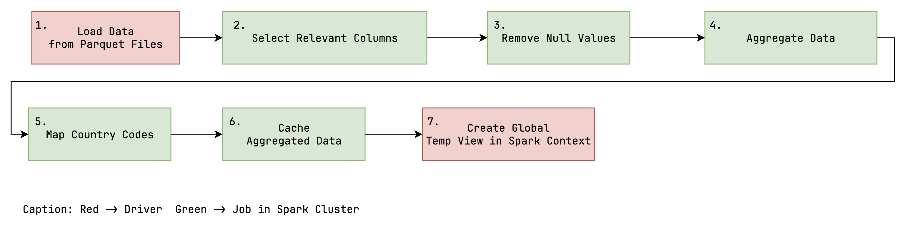

# Big Data Project

<!--- TODO: add short summary of the project --->

## TODO

- [ ] Tests erstellen
    - [X] Scalability (load, queries) -> Gleiche Datenmenge, alles In-Memory, Requests in parallelen Threads, Average
      pro Request
    - [X] Scalability (n worker) -> Gleiches Setup, unterschiedliche Anzahl an Worker, alles In-Memory
    - [X] Scalability (data) -> Unterschiedliche Datenmengen, RAM als bottleneck
    - [ ] Fault tolerance (kill worker)
- [ ] Tests ausführen
- [ ] Jupyter Notebook Markdown Erklärungen
- [ ] Diagramme von Testergebnissen
- [x] Daten bereitstellen & Einfügen ermöglichen
- [ ] Github Readme
    - [x] Nutzungsanleitung anpassen -> Daten reinziehen, Kernel restarten
    - [x] References (Superset Docker Compose, Bitnami Docker Images)
    - [ ] Untersuchungen/Erläuterungen in Readme integrieren
- [ ] Erläuterungen
    - [ ] Prototyp
        - [X] Architektur(NC)
        - [X] Workflow (NC)
        - [ ] Superset Dashboard
    - [ ] Case
        - Big Data (Warum Big Data Case? Warum nicht mit traditionellen Lösungen umsetzbar)
        - Verteilung, Parallelisierung, Skalierbarkeit, Fault Tolerance, Data Storage
        - Shortcuts/Limitations
    - [ ] Skalierbarkeit
        - Auswirkung zusätzlicher Daten/Queries ~ Ressourcen
        - Datenfluss (IO-/Memory-/CPU-bound)
        - Skalierbarkeit der einzelnen Abschnitte
        - Partitionierung
        - Dimensionierung für Realität (Kosten, Aufwand, Expertenwissen, Hardware)
    - [ ] Fault Tolerance
        - Verhalten bei Fehlern (kill Node)
        - Verhalten Netzwerkunterbrechung
        - Auswirkung von Fehleroleranzmechanismen auf System
- [ ] Ausblick
    - [ ] Reale Architektur (inkl. beteiligter Personen, Komponenten, Hardware) -> Parquet File(s) in HDFS Cluster

## Table of Contents

1. [Getting Started](#getting-started)
    - [Prerequesites](#prerequesites)
    - [Setup](#setup)
2. [Usage](#usage)
    - [Web Interfaces](#web-interfaces)
    - [Run Main Code](#run-main-code)
    - [Run Test Code](#run-test-code)
3. [Documentation](#documentation)
    - [Spark](#spark)
    - [Superset](#superset)
    - [Jupyter](#jupyter)
4. [References](#references)

## Getting Started

### Prerequesites

To run the project you need to have [Docker](https://www.docker.com/get-started/) (including docker compose) installed
and running on your machine.

Additionally, make sure you are using WSL if you're running on Windows:

- Open docker desktop
- Navigate to `Settings` > `General`
- Tick the box next to `Use the WSL 2 based engine`
- Restart the docker engine

<!---
Additionally you need to allow docker to access the files in this repository:

- Open docker desktop
- Navigate to `Settings` > `Ressources` > `File sharing`
- Add the file path to the repository 
--->

### Setup

First you have to clone this repository.
Then open your command line and navigate to the root directory of this repository.
To setup the project, execute the following command:

```
docker compose up
```

This will automatically start and configure all necessary docker containers to run Apache Superset, Apache Spark and a
Jupyter Server.

To shut down the all containers, execute the following command:

```
docker compose down --volumes
```

## Usage

### Web Interfaces

The following web interfaces can be accessed after the setup has been completed successfully:

| Component          | URL                    | Description                                                                                                                       |
|:-------------------|:-----------------------|:----------------------------------------------------------------------------------------------------------------------------------|
| Superset Dashboard | http://localhost:8088/ | Apache Superset web interface for visualizing data processed by spark.                                                            |
| Spark Master       | http://localhost:8080/ | Web UI for the Spark master node, managing distributed processing jobs.                                                           |
| Spark Worker 1     | http://localhost:8081/ | Web UI for a Spark worker node, showing details of tasks and resource usage.                                                      |
| Spark Worker 2     | http://localhost:8082/ |                                                                                                                                   |
| Spark Worker 3     | http://localhost:8083/ |                                                                                                                                   |
| Spark Application  | http://localhost:4040/ | Spark application web UI, showing details of jobs, thrift server etc. (available when a spark session is initialized in juypter). |
| Juypter Notebook   | http://localhost:8888/ | JupyterLab interface to interactively execute the python code of this project.                                                    |

### Run Main Code

To run the application code of the project you have to to the following steps:

1. Open the **Jupyter Notebook** web interface
2. When prompted for a token type in `token`
3. Navigate to `notebooks` > `main.ipynb`
4. Run the code cells in the notebook
5. Open the **Superset Dashboard** to view the results
6. When prompted for a login use the following credentials:
    - Username: `admin`
    - Password: `admin`

**Don't start a seperate jupyter server to run the notebook.**

### Run Test Code

1. Open the **Jupyter Notebook** web interface
2. When prompted for a token type in `token`
3. Navigate to `notebooks` > `tests.ipynb`
4. Insert test data
    1. Navigate to `notebooks` > `data` > `parquet_test`
    2. Download the ZIP file from [bwSync&Share](https://bwsyncandshare.kit.edu/s/QTKj5jtPEH3KMkF)
    3. Extract the parquet files into the `parquet_test` directory
4. If you previously ran the main code, you need to **restart the kernel**
5. Run the code cells in the notebook

** We recommend not to run the test code, as the execution can take up to a full day.**

## Documentation

### Architecture
This section describes the architecture of the application.


The application is managed through a docker-compose environment. This environment consists of the following relevant
main components: **Apache Superset**, **Apache Spark Cluster**, **Jupyter Server**, **Thrift Server**.

**Apache Superset** is a data exploration and visualization web application. It is used to visualize the data processed
by Spark. If data is required for a visualization, a SQL-Query is sent to the Thrift Server.

**Apache Spark** is a distributed processing framework. It is used to process the data from the GDELT dataset.
Spark runs distributed in multiple containers with different roles. The **Spark Driver** is the main coordinator of the
application. It is responsible for scheduling the Jobs and catering to the requests from Superset. The **Spark Master**
is the main cluster coordinator of the worker nodes in the standalone deployment mode. The **Spark Worker** is a node
in the cluster that can run tasks and keep data in memory or disk storage across them. Both the Master and the Worker
work in tandem with the driver to run tasks.

**Thrift Server** is a server that enables JDBC/ODBC clients to execute SQL queries against Apache Spark.
In this case, the Thrift Server is used to enable Superset to access the data in Spark. If a SQL-Query is sent to the
Thrift Server, a new Spark job will be triggered. The Spark job will then retrieve the data from the cache and process
it according to the SQL-Statement. The processed data will then be returned to the Thrift Server and then to Superset.

**Jupyter Server** is a web application that allows you to create and share documents that contain live code, equations,
visualizations and narrative text. It is used to run the application code of the project. The application code is
written in a Jupyter Notebook. The Jupyter Server is also used to run the test code of the project.
Furthermore, the Jupyter Notebook is used to document the project and run the Spark Driver and Thrift Server.
Both the Thrift Server and the Spark Driver are started in the Jupyter Notebook because they are required to 
run in the same Spark Context.

### Workflow
This section describes the general workflow of the application.

**Download Data**

At first, it is necessary to download the necessary data from the GDELT server.
The basis is the [GDELT 2.0 Event Database](http://data.gdeltproject.org/gdeltv2/masterfilelist.txt) which is available in CSV format.
The CSV files are downloaded in a compressed form and then extracted.

After extraction, the CSV files will be converted into the parquet format through parallel and distributed processing
using Spark. The parquet format is a columnar storage format that is optimized for analytics workloads.
The parquet files will then be stored in the local file system.

**Process Data(Non Aggregated)**

For the first case, the data is processed in a non-aggregated form. 

The data is loaded from the local file system into Spark. After that, the data is cleaned, so that
only the usable data remains. Thereafter, an additional column will be joined to the data,
which contains the country codes in the FIPS 10-4 standard. This is necessary because the country codes 
which are used in the GDELT dataset are in the ISO 3166-1 alpha-2 standard which is not supported by Superset.

Afterward, the data will be cleaned again and then cached and provisioned as a global temporary view in Spark.
This enables the thrift server to access the data.

**Process Data(Aggregated)**

For the second case, the data is processed in an aggregated form.

The steps are the same as in the first case, except that the data is aggregated before it is cached.
The aggregation depends on the needs of the user. A data scientist can then decide how the data should be aggregated.
Subsequently, only the aggregated data is cached and provisioned as a global temporary view in Spark like in the first case.

**Request from SuperSet**

Another component of the application is the Apache Superset dashboard. This dashboard is used to visualize
the data processed by Spark. The dashboard is connected to the Spark Thrift Server. 
This enables the dashboard to access the data in Spark so that it can also utilize the distributed processing capabilities of Spark.

If a dashboard is opened, a request including a SQL-Statement is sent to the Thrift Server.
The Thrift Server then processes the SQL-Statement and looks for the data in the specified global temporary view.
Retrieving data from the global temporary view will trigger a new Spark job.
The Spark job will then retrieve the data from the cache and process it according to the SQL-Statement.
The processed data will then be returned to the Thrift Server and then to the dashboard.
The dashboard then can utilize the returned data to visualize it according to the user's needs.

## References

The following components were taken from other sources, adapted, configured and integrated into this project:

- [Superset](https://github.com/apache/superset)
  - Docker compose file (foundation of `docker-compose.yml`)
  - Startup scripts (`docker`)
- [Spark](https://github.com/bitnami/containers/tree/main/bitnami/spark)
  - Docker image for Spark Master & Workers
- [Jupyter](https://github.com/jupyter/docker-stacks/tree/main/images/pyspark-notebook)
  - Docker image for Jupyter Notebook
  - Includes an installation of Spark

<!---
## Notes

Connection URI from Superset to the Thrift Server

```
hive://spark@jupyter:10000/default

find [directory] -type d -empty -exec touch {}/.gitkeep \;

```
--->
